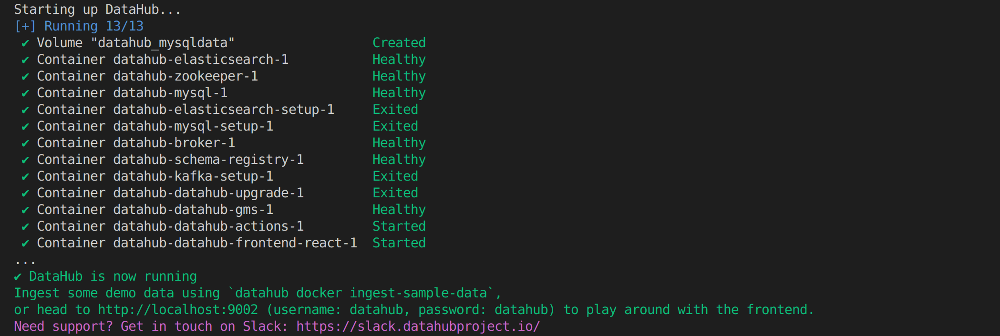

<a id="readme-top"></a>


## About The Project

<p align="right">(<a href="#readme-top">back to top</a>)</p>


## Getting Started


### General Setup

1. Clone the repository:
```sh
git clone https://github.com/dinhln03/HM-ScalableRecs.git
```

2. Change directory to the project root and export the project root path:
```sh
cd HM-ScalableRecs
export ROOT_DIR=$(pwd)
```

3. Install [Poetry](https://python-poetry.org/docs/#installing-with-the-official-installer) to manage dependencies

4. Install [miniconda](https://docs.anaconda.com/miniconda/install/#installing-miniconda) to manage Python environments

5. Create a new conda environment with Python 3.11.9:
```sh
conda create --prefix ./.venv python=3.11.9
```

6. Make the Poetry use the new Python 3.11.9 conda environment:
```sh
poetry env use ./.venv/bin/python
```

7. Install the project dependencies:
```sh
poetry install
```

8. Create .env file based on the .env.example file.


### I. Data Preparation

1. Checkout the notebook 001-eda.ipynb in notebooks folder to explore the data. 

2. Build up Data Hub, a framework of unified discovery, observability, and governance for data:
    ```sh
    make datahub-up
    ```

    **Expected output:**

    

3. Build up OLTP and Data Warehouse (both are Postgre) to store the data:
    ```sh
    make oltp-dwh-up
    ```

    **Expected output:**

    
